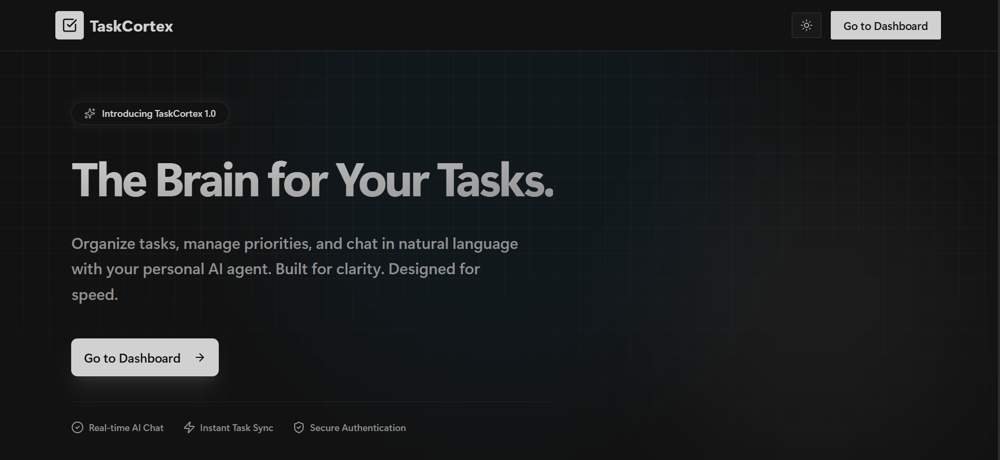
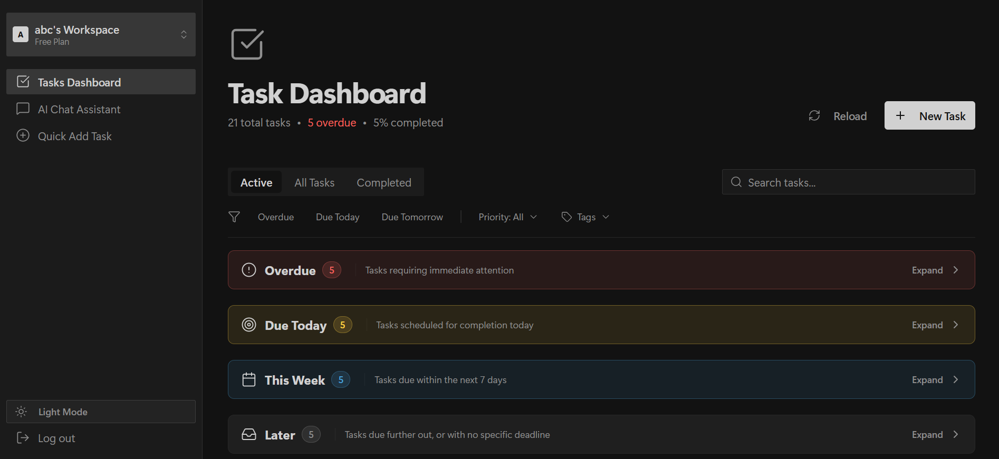

# 🚀 AI-Based Task Manager


An intelligent, full-stack task management system that allows users to seamlessly manage their daily workflow using natural language. Built with a modern tech stack, this application features a sleek, mobile-responsive glassmorphism UI and a powerful AI chat assistant that can create, update, and manage your tasks for you.

## 📸 Screenshots

| Landing Page | Dashboard |
|:---:|:---:|
|  |  |

## ✨ Key Features

- **🤖 AI Task Assistant:** Talk to your AI assistant to add tasks, set due dates, and organize your workflow using natural language.
- **📊 Modern Dashboard:** A beautiful, intuitive dashboard with Kanban-style task grouping, intelligent filtering, and search capabilities.
- **📱 Fully Responsive:** Carefully crafted mobile-first design with a sliding navigation drawer and glassmorphism chat overlays.
- **🔐 Secure Authentication:** Robust JWT-based authentication system powered by Better Auth.
- **🌗 Theming:** Built-in support for Light and Dark modes.

---

## 🛠️ Tech Stack

### Frontend
- **Framework:** Next.js (App Router)
- **Styling:** Tailwind CSS + Shadcn/UI
- **Icons:** Lucide React

### Backend
- **Framework:** FastAPI (Python)
- **ORM:** SQLModel
- **Database:** PostgreSQL (Neon)
- **AI Integration:** Mistral (or any OpenAI-compatible endpoint)
- **Authentication:** Better Auth

---

## 🚀 Getting Started

Follow these instructions to get a copy of the project up and running on your local machine for development and testing.

### Prerequisites
Make sure you have the following installed:
- [Node.js](https://nodejs.org/) (v18 or higher)
- [Python](https://www.python.org/) (v3.10 or higher)
- A [PostgreSQL](https://www.postgresql.org/) database (or a cloud provider like Neon)

### 1. Clone the repository
```bash
git clone https://github.com/0xabdullah27/AI-based_Task-Manager.git
cd AI-based_Task-Manager
```

### 2. Backend Setup
Navigate to the backend directory and set up your Python environment:
```bash
cd backend
python -m venv venv
source venv/bin/activate  # On Windows use: venv\Scripts\activate
pip install -r requirements.txt
```

**Environment Variables:**
Create a `.env` file in the `backend` directory. You can copy the provided example:
```bash
cp .env.example .env
```
Make sure to fill in your `DATABASE_URL` and `LLM_API_KEY` (with your chosen LLM provider key) in the `.env` file.

**Run the Server:**
```bash
uvicorn src.main:app --reload
```
The backend API will be running at `http://localhost:8000`.

### 3. Frontend Setup
Open a new terminal window, navigate to the frontend directory, and install dependencies:
```bash
cd frontend
npm install
```

**Environment Variables:**
Create a `.env.local` file in the `frontend` directory based on the example:
```bash
cp .env.example .env.local
```

**Run the Client:**
```bash
npm run dev
```
The frontend will be running at `http://localhost:3000`.

---

## 📁 Project Structure

```text
AI-based_Task-Manager/
├── backend/                  # FastAPI Backend
│   ├── src/
│   │   ├── api/              # Route definitions and controllers
│   │   ├── models/           # SQLModel database schemas
│   │   └── services/         # Core business logic & AI Agent orchestration
│   └── .env.example          # Backend configuration template
│
├── frontend/                 # Next.js Frontend
│   ├── src/
│   │   ├── app/              # Next.js App Router (Pages & Layouts)
│   │   ├── components/       # Reusable UI components (Shadcn, Chat, Sidebar)
│   │   ├── lib/              # Utility functions and API clients
│   │   └── providers/        # React Context providers (Auth, Theme, Tasks)
│   └── .env.example          # Frontend configuration template
```

---

## 🤝 Contributing

Contributions, issues, and feature requests are welcome! 
If you have suggestions for improving this project, feel free to fork the repo and create a pull request.

## 📝 License

This project is open-source and available under the MIT License.